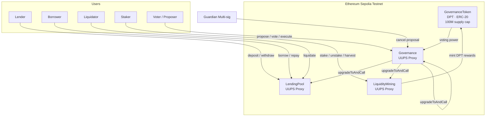

# DeFi Protocol Suite

**SC6107 Blockchain Development Fundamentals (Part 2) — Option 3: Upgradeable DeFi Protocol Suite**
MSc (Blockchain) Programme · 【Group 5】

> A composable, fully upgradeable DeFi protocol consisting of a multi-asset lending pool, a liquidity mining system, and an on-chain governance module. All three contracts use the UUPS (EIP-1967) proxy pattern, meaning the protocol can be upgraded — but only through a community governance vote with a mandatory timelock. There is no admin key.

**Live Demo:** `http://localhost:5173` (local Anvil)
**GitHub:** [Yokiio30/DEFI-PROTOCOL](https://github.com/Yokiio30/DEFI-PROTOCOL)

---

## Table of Contents

1. [Project Overview](#project-overview)
2. [Architecture](#architecture)
3. [Smart Contracts](#smart-contracts)
4. [Quick Start](#quick-start)
5. [Deployment Guide](#deployment-guide)
6. [User Guide](#user-guide)
7. [Testing](#testing)
8. [Security](#security)
9. [Gas Optimization](#gas-optimization)
10. [Team Contributions](#team-contributions)
11. [Known Limitations & Future Work](#known-limitations--future-work)

---

## Project Overview

### Problem

Smart contracts are immutable by design — once deployed, the code cannot be changed. For a DeFi protocol this creates a dilemma:

- **No upgradeability** → a critical bug discovered after deployment permanently locks user funds
- **Admin-key upgradeability** → a single compromised private key can steal everything (a common attack vector responsible for billions in losses)

### Solution

This project implements three DeFi modules where **upgradeability is controlled by the protocol's own governance system**, not a private key:

| Module | Contract | Core Function |
|--------|----------|---------------|
| Lending Pool | `LendingPool.sol` | Multi-asset deposits, collateralised borrowing, automated liquidations |
| Liquidity Mining | `LiquidityMining.sol` | LP token staking, time-weighted DPT reward distribution |
| Governance | `Governance.sol` | On-chain proposals, token-weighted voting, timelock execution |
| Governance Token | `GovernanceToken.sol` | DPT ERC-20 — voting power and mining rewards |

To upgrade any contract, a community member must: (1) hold ≥ 1,000 DPT to submit a proposal, (2) get ≥ 10,000 DPT to vote in favour, (3) wait through a 2-day timelock before the upgrade executes. No single entity can force an upgrade unilaterally.

---

## Architecture

### System Diagram



### UUPS Upgrade Pattern

All three protocol contracts share the same upgrade mechanism:

```
┌─────────────────────────┐        ┌──────────────────────────────┐
│   ERC1967Proxy          │        │   Implementation V1          │
│                         │        │                              │
│  • Holds ALL state      │──────▶ │  • Logic only (stateless)    │
│  • Address never        │delegate│  • __disableInitializers()   │
│    changes              │  call  │  • _authorizeUpgrade()       │
│  • Fallback → impl      │        │    → only Governance can call│
└─────────────────────────┘        └──────────────────────────────┘
                                              │
                              Upgrade flow (requires governance vote):
                              Deploy V2 → propose() → vote (3 days)
                              → queue() → wait (2 days) → execute()
                                              │
                                              ▼
                                   ┌──────────────────────────────┐
                                   │   Implementation V2          │
                                   │  • Appended state only       │
                                   │  • All existing state intact │
                                   └──────────────────────────────┘
```

**Storage safety rule:** State variables are never removed or reordered across upgrades — only appended.

### Component Interaction

```
Frontend (React + ethers.js v6)
    │
    ├── LendingDashboard ──read/write──▶ LendingPool Proxy
    ├── MiningDashboard  ──read/write──▶ LiquidityMining Proxy
    └── GovernanceDashboard ─read/write▶ Governance Proxy
                                              │
                                         GovernanceToken
                                         (balance = voting power)
```

---

## Smart Contracts

### LendingPool.sol

A multi-asset lending pool with a utilisation-based interest rate model. Interest accrues in O(1) time using a global share index — no per-user loops.

**Interest Rate Model (Two-Slope):**
```
Utilisation U = totalBorrows / totalDeposits

U ≤ 80%:  APR = 2% + 8%  × (U / 80%)
U > 80%:  APR = 2% + 8% + 250% × ((U − 80%) / 20%)
```

This means the cost of borrowing increases steeply when the pool is near capacity, which incentivises repayment and protects depositors.

**Key Functions:**

| Function | Parameters | Description |
|----------|------------|-------------|
| `deposit(asset, amount)` | ERC-20 address, token amount | Deposit tokens and receive yield-bearing shares |
| `withdraw(asset, shares)` | ERC-20 address, share amount | Burn shares and receive tokens + accrued interest |
| `borrow(asset, amount)` | ERC-20 address, token amount | Borrow against deposited collateral (max 75% LTV) |
| `repay(asset, shares)` | ERC-20 address, debt share amount | Repay outstanding debt |
| `liquidate(borrower, debtAsset, collateralAsset, shares)` | addresses + share amount | Liquidate an unhealthy position; caller receives 5% bonus |
| `healthFactor(user)` | wallet address | Returns health factor as 18-decimal fixed-point; values below 1e18 are liquidatable |
| `getBorrowRate(asset)` | ERC-20 address | Per-second borrow rate in Ray (1e27) |
| `getDepositRate(asset)` | ERC-20 address | Per-second deposit rate in Ray (1e27) |
| `addAsset(asset, cf, lt, pen, rf)` | see below | **Owner only** — register a new collateral/borrow asset |

`addAsset` parameters: `collateralFactor` (max LTV in basis points, e.g. 7500 = 75%), `liquidationThreshold` (e.g. 8000 = 80%), `liquidationPenalty` (e.g. 500 = 5%), `reserveFactor` (protocol fee share, e.g. 1000 = 10%).

**Events:** `AssetAdded`, `Deposited`, `Withdrawn`, `Borrowed`, `Repaid`, `Liquidated`

---

### LiquidityMining.sol

A Masterchef-style multi-pool staking contract. Multiple reward tokens with independent schedules are supported.

**Reward Formula:**
```
Each update:
  poolReward        = elapsed × rewardPerSecond × allocPoint / totalAllocPoint
  accRewardPerShare += poolReward × PRECISION / totalStaked

User claim:
  pending = userStaked × accRewardPerShare / PRECISION − rewardDebt
```

This design ensures reward calculation costs O(1) gas regardless of the number of stakers.

**Key Functions:**

| Function | Parameters | Description |
|----------|------------|-------------|
| `stake(pid, amount)` | pool ID, token amount | Stake LP tokens; snapshots any accrued rewards into claimable balance |
| `unstake(pid, amount)` | pool ID, token amount | Withdraw LP tokens; snapshots accrued rewards into claimable balance (call `harvest` to receive them) |
| `harvest(pid, rewardIdx)` | pool ID, reward token index | Claim pending rewards for a specific reward token |
| `emergencyWithdraw(pid)` | pool ID | Withdraw all staked tokens immediately, forfeiting rewards |
| `pendingReward(pid, user)` | pool ID, wallet | View pending reward amount (no state change) |
| `addPool(lpToken, allocPoint)` | token address, weight | **Owner only** — add a new staking pool |
| `setPool(pid, allocPoint)` | pool ID, weight | **Owner only** — update a pool's allocation weight |
| `addRewardToken(token, rate, start, end)` | see below | **Owner only** — add a reward token with emission schedule |

**Events:** `Staked`, `Unstaked`, `Harvested`, `EmergencyWithdraw`, `PoolAdded`, `RewardTokenAdded`

---

### Governance.sol

Full on-chain governance with timelock execution and Guardian emergency veto.

**Proposal Lifecycle:**

```
propose()        (voting delay: 1h)        (voting period: 3d)
   │                    │                        │
Pending ──────────▶ Active ──── forVotes > quorum AND > againstVotes ──▶ Succeeded
                       │                                                      │
                       └── quorum not met OR againstVotes ≥ forVotes ──▶ Defeated    queue()
                       │                                                              │
                       └── proposer or Guardian calls cancel() ──▶ Cancelled     Queued
                                                                                      │
                                                                  (timelock: 2d)    execute()
                                                                                      │
                                                                                  Executed
                                                                              OR  Expired (>14d)
```

**Governance Parameters:**

| Parameter | Default | Adjustable Range |
|-----------|---------|-----------------|
| Voting delay | 1 hour | Set at initialisation |
| Voting period | 3 days | Set at initialisation |
| Timelock delay | 2 days | 1 day – 30 days |
| Proposal threshold | 1,000 DPT | Set at initialisation |
| Quorum | 10,000 DPT | Set at initialisation |
| Grace period | 14 days | Constant |

**Key Functions:**

| Function | Parameters | Description |
|----------|------------|-------------|
| `propose(targets, values, calldatas, description)` | arrays + string | Create a proposal; caller needs ≥ threshold DPT |
| `castVote(proposalId, support)` | ID, 0/1/2 | Vote: 0=Against, 1=For, 2=Abstain |
| `queue(proposalId)` | proposal ID | Queue a succeeded proposal for timelock |
| `execute(proposalId)` | proposal ID | Execute after timelock elapses |
| `cancel(proposalId)` | proposal ID | Cancel — callable by proposer or Guardian |
| `state(proposalId)` | proposal ID | Returns current state as enum |
| `getProposal(proposalId)` | proposal ID | Returns full proposal struct |
| `setTimelockDelay(delay)` | seconds | **Owner only** — adjust timelock delay |
| `setGuardian(newGuardian)` | address | **Guardian only** — transfer Guardian role |

**Events:** `ProposalCreated`, `VoteCast`, `ProposalQueued`, `ProposalExecuted`, `ProposalCancelled`

---

### GovernanceToken.sol

Standard ERC-20 token with mint (owner-only) and burn functionality.

| Parameter | Value |
|-----------|-------|
| Name | DeFi Protocol Token |
| Symbol | DPT |
| Decimals | 18 |
| Supply cap | 100,000,000 DPT |
| Initial mint | 10,000,000 DPT to deployer |

---

## Quick Start

### Prerequisites

| Tool | Version | Install |
|------|---------|---------|
| Foundry (forge, cast, anvil) | latest | https://getfoundry.sh |
| Node.js | v16 or v18 | https://nodejs.org |
| MetaMask | latest | Browser extension |

Verify Foundry is installed:
```bash
# macOS / Linux
forge --version

# Windows (Foundry installs to user profile)
C:\Users\YOUR_NAME\.foundry\bin\forge.exe --version
```

### Install Contract Dependencies

```bash
cd contracts
forge install
```

### Build Contracts

```bash
forge build
# Expected: Compiler run successful! (warnings about block.timestamp are expected and safe)
```

### Run Tests

```bash
forge test -vv
# Expected: 100 tests passed, 0 failed
```

---

## Deployment Guide

### Option A — Local Demo with Anvil

This option requires no ETH and deploys everything automatically.

**Step 1 — Start the local blockchain (keep this terminal open)**

```bash
# macOS / Linux
anvil

# Windows
C:\Users\YOUR_NAME\.foundry\bin\anvil.exe
```

Anvil prints 10 pre-funded accounts. The first two are used for this demo:
```
Account 0 (Deployer): 0xf39Fd6e51aad88F6F4ce6aB8827279cffFb92266
Private Key:          0xac0974bec39a17e36ba4a6b4d238ff944bacb478cbed5efcae784d7bf4f2ff80

Account 1 (Alice):    0x70997970C51812dc3A010C7d01b50e0d17dc79C8
Private Key:          0x59c6995e998f97a5a0044966f0945389dc9e86dae88c7a8412f4603b6b78690d
```

**Step 2 — Deploy all contracts (any available terminal)**

```bash
# macOS / Linux
cd contracts
forge script script/DemoSetup.s.sol --tc DemoSetupScript \
    --rpc-url http://localhost:8545 \
    --broadcast

# Windows
cd contracts
C:\Users\YOUR_NAME\.foundry\bin\forge.exe script script/DemoSetup.s.sol --tc DemoSetupScript `
    --rpc-url http://localhost:8545 `
    --broadcast
```

> **Note:** `--tc DemoSetupScript` is required because the file contains multiple contracts. Omitting it causes a "Multiple contracts in target path" error.

The script deploys mock WETH and USDC tokens, mints test balances to both accounts, deploys all four protocol contracts, configures mining pools, and funds 50M DPT rewards. At the end it prints contract addresses:

```
====== COPY TO frontend/.env ======
VITE_LENDING_POOL_ADDRESS=  0x...
VITE_MINING_ADDRESS=        0x...
VITE_GOVERNANCE_ADDRESS=    0x...
VITE_GOV_TOKEN_ADDRESS=     0x...
VITE_WETH_ADDRESS=          0x...
VITE_USDC_ADDRESS=          0x...
====================================
```

**Step 3 — Configure the frontend**

`frontend/.env` is already pre-configured with the correct addresses — no changes needed. Anvil uses a deterministic deployer key, so the contract addresses are identical on every fresh deployment:

```bash
VITE_LENDING_POOL_ADDRESS=0x8A791620dd6260079BF849Dc5567aDC3F2FdC318
VITE_MINING_ADDRESS=0x0DCd1Bf9A1b36cE34237eEaFef220932846BCD82
VITE_GOVERNANCE_ADDRESS=0x3Aa5ebB10DC797CAC828524e59A333d0A371443c
VITE_GOV_TOKEN_ADDRESS=0x0165878A594ca255338adfa4d48449f69242Eb8F
VITE_WETH_ADDRESS=0x5FbDB2315678afecb367f032d93F642f64180aa3
VITE_USDC_ADDRESS=0xe7f1725E7734CE288F8367e1Bb143E90bb3F0512
```

> If the file does not exist, create it manually with the content above. Ensure there are no spaces after the `=` sign.

**Step 4 — Start the frontend**

```bash
cd frontend
npm install
npm run dev
# Open http://localhost:5173
```

**Step 5 — Connect MetaMask to local network**

In MetaMask → Add Network → fill in:
- Network name: `Anvil Local`
- RPC URL: `http://127.0.0.1:8545`
- Chain ID: `31337`
- Currency symbol: `ETH`

Then import Account 0 using the private key shown in Step 1.

---

### Option B — Deploy to Sepolia Testnet

Requires Sepolia ETH (available from faucets) and an Infura or Alchemy API key.

```bash
# Set environment variables
export DEPLOYER_PRIVATE_KEY=0x...    # your wallet private key
export RPC_URL=https://sepolia.infura.io/v3/YOUR_KEY
export GUARDIAN_ADDRESS=0x...        # your multi-sig or second wallet
export ETHERSCAN_KEY=...             # for contract verification

# Deploy and verify (takes ~3-5 minutes)
cd contracts
forge script script/Deploy.s.sol \
    --rpc-url $RPC_URL \
    --broadcast \
    --verify \
    --etherscan-api-key $ETHERSCAN_KEY
```

After deployment, follow Steps 3–5 from Option A using Sepolia addresses. Switch MetaMask to the Sepolia network (Chain ID: 11155111).

---

## User Guide

### Connecting Your Wallet

1. Open `http://localhost:5173` in a browser with MetaMask installed
2. Click **Connect Wallet to Start** on the landing page
3. MetaMask will ask for permission — click **Connect**
4. Your wallet address appears in the top-right corner

If the page shows `0x000...0000` as a contract address, check that `frontend/.env` exists and contains the correct deployed addresses, then restart the dev server.

---

### Lending Pool

**How to deposit tokens and earn interest:**
1. Click the **⬡ Lending Pool** tab
2. Under *Deposit & Withdraw*, select an asset (WETH or USDC)
3. Enter an amount and click **Deposit**
4. Approve two MetaMask transactions: the first authorises the contract to spend your tokens, the second completes the deposit
5. Your deposit balance updates and interest begins accruing immediately

**How to borrow:**
1. You must have a deposit first — it serves as collateral
2. Under *Borrow & Repay*, enter a borrow amount
3. Keep the amount below 75% of your collateral value to stay healthy (e.g. deposit 10 WETH → borrow at most 7.5 WETH)
4. Click **Borrow** and confirm in MetaMask
5. Watch the **Health Factor** indicator — green (≥1.5) is safe, amber (1.0–1.5) needs attention, red (<1.0) can be liquidated

**Health Factor explained:**
```
Health Factor = (collateral value × liquidation threshold) / total debt value

∞       → no debt at all
≥ 1.5   → safe (green)
1.0–1.5 → watch closely (amber)
< 1.0   → position can be liquidated (red)
```

**How to repay and withdraw:**
- Click **Repay All** to clear your entire debt (adds a 0.1% buffer to cover interest accrued while the transaction confirms)
- Click **Withdraw All** to retrieve your deposited tokens plus accrued interest

---

### Liquidity Mining

**How to stake and earn DPT rewards:**
1. Click the **⬢ Liquidity Mining** tab
2. Under *Stake*, select a pool from the dropdown
   - Pool #0 (WETH) has 100 allocation points
   - Pool #1 (USDC) has 50 allocation points
   - Pool #0 earns twice as many rewards per token staked as Pool #1
3. Enter an amount and click **Stake** — approve both MetaMask transactions
4. Your position appears in the *Your Positions* table
5. Rewards accumulate every second automatically

**How to claim rewards:**
- Click **Harvest** next to a pool to claim accumulated DPT rewards
- Your DPT balance in MetaMask increases after the transaction confirms

**How to unstake:**
- Click **Unstake All** — this returns your staked tokens. Accrued rewards are saved to your claimable balance but not transferred automatically; click **Harvest** afterwards to receive them

**Emergency Withdraw:**
- If the protocol is paused or something goes wrong, `emergencyWithdraw` lets you retrieve your staked tokens immediately, forfeiting any unclaimed rewards

---

### Governance

**How to create a proposal:**
1. Click the **⬣ Governance** tab
2. You need at least 1,000 DPT to create a proposal (your balance is shown at the top)
3. Fill in:
   - **Description** — what the proposal does and why
   - **Target Contract** — the address of the contract to call (e.g. the LendingPool address to add a new asset)
   - **Calldata** — the ABI-encoded function call. Generate it with:
     ```bash
     cast calldata "functionName(type)" argument
     # Example: cast calldata "setTimelockDelay(uint256)" 86400
     ```
4. Click **Submit Proposal** and confirm in MetaMask

**How to vote:**
1. After the 1-hour voting delay, the proposal status changes from *Pending* to *Active*
2. Select *For*, *Against*, or *Abstain* from the dropdown
3. Click **Cast Vote** — your full DPT balance counts as voting power

**How to execute an approved proposal:**
1. Once the voting period ends and enough votes are in favour (*Succeeded*), click **Queue**
2. After the 2-day timelock, click **Execute** — the transaction runs automatically

**Tip for local testing** — use these commands to skip the waiting periods:

```bash
# macOS / Linux

# Skip voting delay (1 hour)
cast rpc evm_increaseTime 3601 --rpc-url http://localhost:8545
cast rpc evm_mine --rpc-url http://localhost:8545

# Skip voting period (3 days)
cast rpc evm_increaseTime 259200 --rpc-url http://localhost:8545
cast rpc evm_mine --rpc-url http://localhost:8545

# Skip timelock (2 days)
cast rpc evm_increaseTime 172800 --rpc-url http://localhost:8545
cast rpc evm_mine --rpc-url http://localhost:8545
```

```powershell
# Windows — requires full path

# Skip voting delay (1 hour)
C:\Users\YOUR_NAME\.foundry\bin\cast.exe rpc evm_increaseTime 3601 --rpc-url http://localhost:8545
C:\Users\YOUR_NAME\.foundry\bin\cast.exe rpc evm_mine --rpc-url http://localhost:8545

# Skip voting period (3 days)
C:\Users\YOUR_NAME\.foundry\bin\cast.exe rpc evm_increaseTime 259200 --rpc-url http://localhost:8545
C:\Users\YOUR_NAME\.foundry\bin\cast.exe rpc evm_mine --rpc-url http://localhost:8545

# Skip timelock (2 days)
C:\Users\YOUR_NAME\.foundry\bin\cast.exe rpc evm_increaseTime 172800 --rpc-url http://localhost:8545
C:\Users\YOUR_NAME\.foundry\bin\cast.exe rpc evm_mine --rpc-url http://localhost:8545
```

> `evm_mine` must be called after every `evm_increaseTime` — time advances but a new block is not produced until you mine one.

---

## Testing

> All test commands must be run from the `contracts/` directory: `cd contracts`

```bash
# Run all 100 tests
forge test -vv

# Run a specific contract's tests
forge test --match-contract LendingPoolTest -vv
forge test --match-contract GovernanceTest -vv
forge test --match-contract LiquidityMiningTest -vv

# Run only fuzz tests (random input testing)
forge test --match-test testFuzz -vv

# Run only invariant tests (property-based testing)
forge test --match-test invariant -vv

# Gas cost report
forge test --gas-report

# Line coverage report
forge coverage --report summary --ir-minimum
```

**Test results:**

```
Ran 34 tests for LendingPool.t.sol    → 34 passed, 0 failed
Ran 31 tests for Governance.t.sol     → 31 passed, 0 failed
Ran 35 tests for LiquidityMining.t.sol → 35 passed, 0 failed
Total: 100 passed, 0 failed
```

**Coverage by contract (source files only):**

| Contract | Line Coverage | Function Coverage |
|----------|--------------|-------------------|
| Governance.sol | 91.30% | 86.67% |
| GovernanceToken.sol | 100% | 100% |
| LendingPool.sol | 94.34% | 100% |
| LiquidityMining.sol | 91.60% | 100% |

All source contracts exceed the required 80% line coverage threshold.

**Test categories explained:**

| Type | Example | What it verifies |
|------|---------|-----------------|
| Unit | `test_Deposit_ReceivesShares` | Each function works correctly in isolation |
| Integration | `test_FullFlow_StakeHarvestUnstake` | Multiple functions work together correctly |
| Fuzz | `testFuzz_Deposit_AnyAmount(uint256)` | Function behaves correctly for any random input |
| Invariant | `invariant_TotalBorrowsNeverExceedDeposits` | A property holds true across thousands of random operations |
| Upgrade | `test_Upgrade_V2KeepsState` | UUPS upgrade preserves all user data |

---

## Security

Full analysis in [`docs/security-analysis.md`](docs/security-analysis.md).

| Vulnerability | Mitigation |
|--------------|------------|
| **Reentrancy** | `ReentrancyGuardUpgradeable` on all state-changing functions + Checks-Effects-Interactions pattern |
| **Integer overflow/underflow** | Solidity 0.8.x built-in overflow checks throughout |
| **Unauthorised upgrades** | `_authorizeUpgrade` restricted to owner; in production, owner = Governance contract |
| **Flash loan governance attack** | Voting power measured at vote time with 1-hour voting delay; snapshot voting planned for v2 |
| **Malicious upgrade proposal** | 2-day timelock + Guardian (multi-sig) can cancel any queued proposal before execution |
| **Access control bypass** | `onlyOwner` on all admin functions (`addAsset`, `pause`, `addPool`, `setTimelockDelay`) |
| **Emergency** | `pause()`/`unpause()` on LendingPool and LiquidityMining; `emergencyWithdraw` lets users recover funds even when paused |
| **Price oracle manipulation** | 1:1 pricing for testnet only; Chainlink TWAP planned for production |

---

## Gas Optimization

Full analysis in [`docs/gas-optimization.md`](docs/gas-optimization.md).

**Key design choices:**

1. **Share-based accounting (O(1) interest)** — A single global `depositIndex` grows with interest. Any user's balance is `shares × index / RAY`. No loops, no per-user updates.

2. **Ray arithmetic (1e27)** — 27 decimal places of precision avoids floating-point approximations without `SafeMath`.

3. **`via_ir = true`** — Foundry's Yul IR compilation pipeline reduces bytecode size and call costs by ~15–20%.

4. **`optimizer_runs = 200`** — Balances deployment cost and per-call execution cost for typical usage patterns.

**Gas costs for main operations (from `forge test --gas-report`):**

| Function | Gas |
|----------|-----|
| `deposit()` | 99,261 |
| `withdraw()` | 67,001 |
| `borrow()` | 105,139 |
| `repay()` | 42,722 |
| `liquidate()` | 84,680 |
| `stake()` | 100,202 |
| `harvest()` | 117,692 |
| `propose()` | 248,864 |
| `castVote()` | 86,220 |
| `execute()` | 68,448 |

---

## Team Contributions

| Member | GitHub | Primary Responsibility |
|--------|--------|----------------------|
| [LUO YUJIE] | [@Yokiio30](https://github.com/Yokiio30) | LendingPool.sol — interest rate model, liquidation engine, unit + fuzz tests |
| [JIANG XIAOYU] | [@jxy2433889765](https://github.com/jxy2433889765) | LiquidityMining.sol — Masterchef reward algorithm, multi-token support, tests |
| [LIN YUHAO] | [@Linyuhao32](https://github.com/Linyuhao32) | Governance.sol — proposal lifecycle, timelock, deployment scripts |
| [NIAN YIPENG] | [@yipengnian-creator](https://github.com/yipengnian-creator) | React frontend — LendingDashboard, MiningDashboard, GovernanceDashboard, ethers.js v6 integration |
| [XU ZHIXING] | [@xzzzx666666](https://github.com/xzzzx666666) | Security analysis, architecture documentation, gas optimisation report |

Individual contributions are verifiable through the GitHub commit history. Each member committed using their own account throughout the 6-week development period.

---

## Known Limitations & Future Work

| Limitation | Impact | Planned Fix (v2) |
|------------|--------|-----------------|
| 1:1 asset pricing (no oracle) | Health factor and liquidations use simplified pricing; fine for testnet, not production | Integrate Chainlink AggregatorV3 price feeds with TWAP manipulation resistance |
| `balanceOf` voting power | A user could theoretically acquire tokens just before a vote (flash loan attack) | Upgrade to `ERC20Votes` with block-number snapshots |
| Deployer retains admin key | Testnet convenience; single point of failure in production | Transfer contract ownership to the Governance contract at deployment |
| Single reward harvest | Users must call `harvest()` once per reward token | Batch harvest across all reward tokens in a single transaction |
| Linear interest compounding | Slight precision loss over very long time periods | Exponential compounding using compound interest formula |

---

## Repository Structure

```
defi-protocol/
├── contracts/
│   ├── src/
│   │   ├── LendingPool.sol
│   │   ├── LiquidityMining.sol
│   │   ├── Governance.sol
│   │   └── GovernanceToken.sol
│   ├── test/
│   │   ├── LendingPool.t.sol
│   │   ├── LiquidityMining.t.sol
│   │   └── Governance.t.sol
│   ├── script/
│   │   ├── Deploy.s.sol          ← Sepolia deployment
│   │   └── DemoSetup.s.sol       ← Local Anvil one-command setup
│   └── foundry.toml
├── frontend/
│   └── src/
│       ├── App.jsx
│       ├── components/
│       │   ├── LendingDashboard.jsx
│       │   ├── MiningDashboard.jsx
│       │   ├── GovernanceDashboard.jsx
│       │   └── ConnectWallet.jsx
│       └── abis/
├── docs/
│   ├── architecture.md
│   ├── security-analysis.md
│   └── gas-optimization.md
├── scripts/
│   ├── deploy.sh                 ← Linux/macOS deployment helper
│   ├── demo-setup.sh             ← Linux/macOS demo environment setup
│   └── demo-setup.ps1            ← Windows PowerShell demo setup
├── package.json
└── README.md
```

---

## License

MIT
