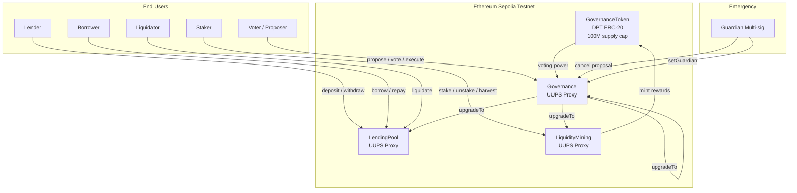
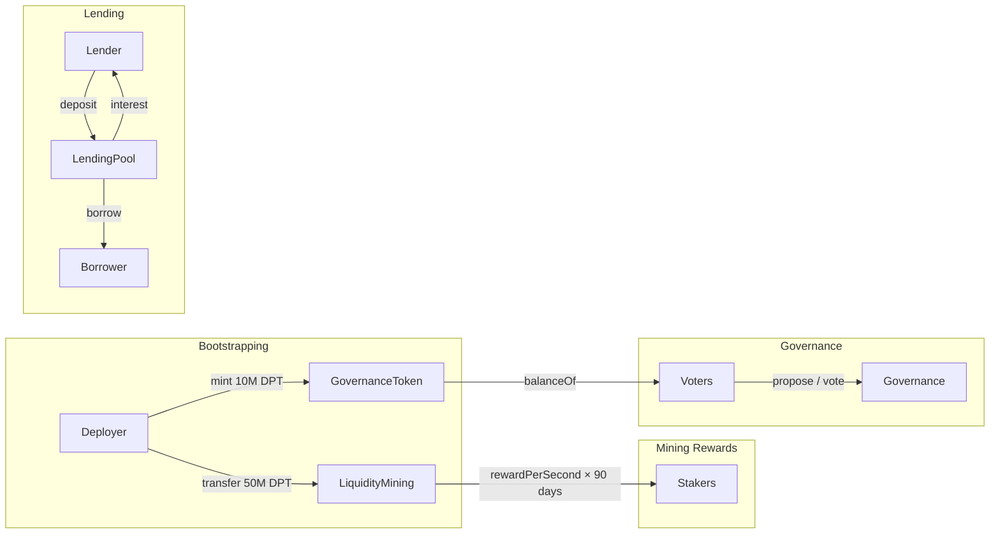

# Architecture — Upgradeable DeFi Protocol Suite

## System Overview

```
┌─────────────────────────────────────────────────────────────────────┐
│                        Frontend (React + ethers.js v6)              │
│  ┌─────────────┐  ┌─────────────────┐  ┌─────────────────────────┐ │
│  │ Lending      │  │ Mining          │  │ Governance              │ │
│  │ Dashboard    │  │ Dashboard       │  │ Dashboard               │ │
│  └──────┬───────┘  └──────┬──────────┘  └──────────┬──────────────┘ │
│         │                 │                         │                │
│         └─────────┬───────┴─────────────┬───────────┘                │
│                   │                     │                            │
└───────────────────┼─────────────────────┼────────────────────────────┘
                    │ MetaMask / ethers.js │
                    └─────────────────────┘
```



---

## Contract Architecture

### Upgradeability Pattern

All three protocol contracts use **UUPS (Universal Upgradeable Proxy Standard, EIP-1967)**:

```
┌──────────────────────┐       ┌──────────────────────────────┐
│   ERC1967Proxy       │──────→│   Implementation V1          │
│                      │delegate│                              │
│  • Storage (all      │  call  │  • Logic only (stateless)    │
│    state lives here)  │       │  • __disableInitializers()   │
│  • Fallback → impl   │       │  • _authorizeUpgrade(owner)  │
│                      │       │  • version() → "1.0.0"       │
└──────────────────────┘       └──────────────────────────────┘
                                         │
                           upgradeToAndCall(newImpl)
                                         │
                                         ▼
                              ┌──────────────────────────────┐
                              │   Implementation V2          │
                              │                              │
                              │  • Appended state (never     │
                              │    reorder or delete)        │
                              │  • New features              │
                              │  • version() → "2.0.0"       │
                              └──────────────────────────────┘
```

**Upgrade authorization flow:**
```
Deploy V2 → Governance.propose(upgradeToAndCall) 
→ Vote (3 days) → Queue (2-day timelock) → Execute
```

**Storage safety:** All state variables declared upfront. Storage layout is append-only across upgrades (no gaps needed with UUPS).

---

### LendingPool Architecture

```
                      ┌──────────────────────┐
                      │     deposit(asset,    │
                      │        amount)        │
                      │                      │
   Lender ───→        │  _updateIndexes()    │
                      │  _toDepositShares()   │
                      │  safeTransferFrom()   │
                      │  _requireHealthy()    │
                      └──────────────────────┘
                                │
                      ┌────────┴─────────────┐
                      │  AssetConfig[]         │
                      │  • totalDeposits       │
                      │  • totalBorrows        │
                      │  • borrowIndex (Ray)   │
                      │  • depositIndex (Ray)  │
                      │  • collateralFactor    │
                      │  • liquidationThreshold│
                      └──────────────────────┘
                                │
                      ┌────────┴─────────────┐
                      │  UserAccount             │
                      │  • depositShares[asset]  │
                      │  • borrowShares[asset]   │
                      └──────────────────────────┘
                                │
   Borrower ←──       ┌────────┴─────────────┐
                      │     borrow(asset,     │
                      │        amount)        │
                      │                      │
                      │  _updateIndexes()    │
                      │  _toBorrowShares()    │
                      │  _requireHealthy()   │
                      │  safeTransfer()       │
                      └──────────────────────┘
```

**Interest Rate Model (Two-Slope):**
```
Utilization U = totalBorrows / totalDeposits

U ≤ 80%:  rate = BASE(2%) + SLOPE1(8%) × (U / 80%)
U > 80%:  rate = BASE(2%) + SLOPE1(8%) + SLOPE2(250%) × ((U-80%) / 20%)
```

**Share-Based Accounting (O(1) per operation):**
```
toShares(amount)   = amount × RAY / index
fromShares(shares) = shares × index / RAY

borrowIndex  += borrowIndex  × borrowRate  × elapsed / RAY
depositIndex += depositIndex × depositRate × elapsed / RAY
```

**Liquidation Flow:**
```
1. Liquidator calls liquidate(borrower, debtAsset, collateralAsset, shares)
2. Check: healthFactor(borrower) < 1e18
3. Max 50% of debt per liquidation
4. Liquidator repays debtAsset debt
5. Liquidator receives collateralAsset × (1 + liquidationPenalty)
6. State: borrowShares↓, depositShares↓, totalBorrows↓, totalDeposits↓
```

---

### LiquidityMining Architecture

```
                      ┌──────────────────────┐
                      │     stake(pid,        │
                      │        amount)        │
   Staker ───→        │                      │
                      │  _updatePool(pid)     │
                      │  harvest pending      │
                      │  safeTransferFrom()   │
                      │  rewardDebt = new     │
                      └──────────────────────┘
                                │
                      ┌────────┴─────────────┐
                      │  PoolInfo[]             │
                      │  • lpToken              │
                      │  • allocPoint           │
                      │  • accRewardPerShare    │
                      │  • totalStaked          │
                      │  • lastRewardTime       │
                      └──────────────────────┘
                                │
                      ┌────────┴─────────────┐
                      │  RewardToken[]          │
                      │  • token (e.g. DPT)     │
                      │  • rewardPerSecond      │
                      │  • startTime / endTime  │
                      └──────────────────────┘
```

**Reward Formula (Masterchef Algorithm):**
```
poolReward = elapsed × totalRewardPerSec × allocPoint / totalAllocPoint
accRewardPerShare += poolReward × PRECISION / totalStaked
pending = userStaked × accRewardPerShare / PRECISION - rewardDebt
```

---

### Governance Architecture

**State Machine:**

```mermaid
stateDiagram-v2
    [*] → Pending : propose()
    Pending → Active : votingDelay elapsed
    Active → Succeeded : forVotes > quorum AND forVotes > againstVotes
    Active → Defeated : quorum not met OR againstVotes >= forVotes
    Active → Cancelled : proposer/guardian cancel()
    Pending → Cancelled : proposer/guardian cancel()
    Succeeded → Queued : queue()
    Queued → Executed : execute() after timelock
    Queued → Expired : grace period passed
    Succeeded → Defeated : (via re-check)
```


**Parameter Defaults:**
| Parameter | Value | Configurable |
|-----------|-------|-------------|
| Timelock Delay | 2 days | Yes (1-30 days) |
| Voting Delay | 1 hour | On init |
| Voting Period | 3 days | On init |
| Proposal Threshold | 1,000 DPT | On init |
| Quorum | 10,000 DPT | On init |
| Grace Period | 14 days | Constant |

**Security Model:**
- Upgrade proposals require governance vote + timelock execution
- Guardian (multi-sig) can cancel any non-executed proposal
- `_disableInitializers()` prevents implementation re-initialization
- `onlyOwner` check on `_authorizeUpgrade`

---

### Token Flow



---

## Frontend Architecture

```
App.jsx
├── ConnectWallet.jsx         # MetaMask connection + chain/account events
├── LendingDashboard.jsx      # Deposit/Borrow/Repay/Withdraw + stats
│   └── ABIs/LendingPool.json
├── MiningDashboard.jsx       # Stake/Unstake/Harvest + pool table
│   └── ABIs/LiquidityMining.json
└── GovernanceDashboard.jsx   # Propose/Vote/Queue/Execute + proposals list
    ├── ABIs/Governance.json
    └── ABIs/GovernanceToken.json
```

**Data Flow:**
1. User connects MetaMask → `ethers.BrowserProvider` → signer + address
2. Contract instances created with provider (read) or signer (write)
3. State refreshed via `Promise.all` parallel contract reads
4. Transactions: approve → action → wait → refresh state
5. Auto-connect on page load if already authorized

---

## Current Limitations (v1.0.0)

| Limitation | Impact | Planned Fix |
|------------|--------|-------------|
| 1:1 asset pricing | Incorrect HF / liquidation | Chainlink TWAP oracle |
| balanceOf voting | Flash loan governance attack | ERC20Votes snapshot |
| Single reward per harvest | UX for multi-reward pools | Batch harvest |
| No cross-asset collateral | Limited borrowing efficiency | Multi-collateral support |
| Linear interest compounding | Slight precision loss over long periods | Exponential compounding |
